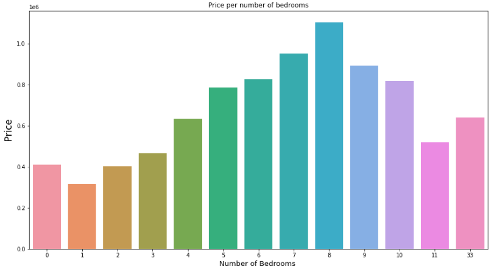

# House Rocket

### The Challenge

House Rocket is a digital platform whose business model is the purchase and sale of properties using technology.

You are a Data Scientist contracted by the company to help you find the best business opportunities in the real estate market.
House Rocket's CEO would like to maximize the company's revenue by finding good business opportunities.

Its main strategy is to buy good houses in great locations with low prices and then resell them later at higher prices. 
The greater the difference between buying and selling, the greater the company's profit and therefore the greater its revenue.
However, houses have many attributes that make them more or less attractive to buyers and sellers, and the location and time of year can also influence prices.

Therefore, your job as a Data Scientist is to answer the following questions:

- 1. **Which houses should the House Rocket CEO buy and at what purchase price?**

- 2. **Once the house is owned by the company, what is the best time to sell it and what would be the price of the sale?**

- 3. **Should House Rocket do a renovation to increase the sale price? What would be the suggestions for changes? What is the increase in the price given for each retirement option?**

Challenge link: https://sejaumdatascientist.com/os-5-projetos-de-data-science-que-fara-o-recrutador-olhar-para-voce/

## Solution Planning
- 1 - **Business Problem**
    -  Why did the CEO ask these questions? If you were him, why would you ask that? Want to increase revenue? Is the company doing well?

- 2 - **Data collection**
    - On kaggle:  https://www.kaggle.com/harlfoxem/housesalesprediction
- 3 - **Data Preparation**
- 4 - **Creating Hypotheses about the problem**
- 5 - **Exploratory Data Analysis**
- 6 - **Report with insights and possible solutions to the CEO problem**

## Solution tools
The project was developed with the Python programming language version 3.9.0 and its libraries such as: Pandas, Numpy, SeaBorn, etc.
The IDEs used were Jupyter Notebook and VSCode

# Top Data Insights

##### H1- Houses with water views are more expensive on average.

True, Water view houses are on **average $1.130.312,42** more expensive
##### H2 Houses with more rooms are more expensive on average.

The price grows only between 1 and 8 bedrooms.
##### H3 Price per type of condition.

Diff between condition  2 and condition  1  is : 6.29 % 

Diff between condition  3 and condition  2  is : **61.29 %** 

Diff between condition  4 and condition  3  is : -2.22 % 

Diff between condition  5 and condition  4  is : 19.55 %

# Answering the CEO's questions
- ##### Which houses should the House Rocket CEO buy and at what purchase price?
The suggestions for houses to be purchased are houses with good conditions (type 3 or greater) and that have their price below the average price of their type of condition.

- #####  Once the house is owned by the company, what is the best time to sell it and what would be the price of the sale?
The best time to sell is **Summer and Spring** and the suggested retail price is 30% more expensive than the purchase price.
I calculated three scenarios:
1 - Expected profit: Average profit of 20%
2- Best scenario: Average profit of 30%
3 - Worst case scenario: Average profit of 15%
| Profit Expected   | Best Scenario       | Worst Scenario  |
|:------------------|:--------------------|:----------------|
| \$ 676,153,494.80 | \$ 1,014,2300,242.20  | \$ 507,115,121.10|

- ##### Should House Rocket do a renovation to increase the sale price? What would be the suggestions for changes? What is the increase in the price given for each retirement option?
In H3, we can see that the biggest increase is from condition 2 to 3 with an **increase of 61.29%**
So, my suggestion is to buy houses with type 2 condition, renovate and sell at the average price of type 3 condition.
I'm guessing that the renovation will cost 20% of the house price.
My profit in this case will be the average price of the type 3 condition minus the new price after the reform.
I calculated three scenarios:

1- Expected profit: Sales price equal to 90% of the average price of condition 3, which generates an average **profit of 77.78%**
2- Best scenario: Sales price equal to the average price of condition 3, which generates an average **profit of 97.53%**
3- Worst scenario: Sales price equal to 80% of the average price of condition 3, which generates an average **profit of 58.02%**

#### Total expected profit:

| Profit Expected   | Best Scenario       | Worst Scenario  |
|:------------------|:--------------------|:----------------|
| \$ 691,214,418.80 | \$ 1,033,116,166.20  | \$ 518,351,045.10|

# Deploy Report
The report was made with streamlit and deployed on Heroku

link: https://house-rocket.herokuapp.com/

